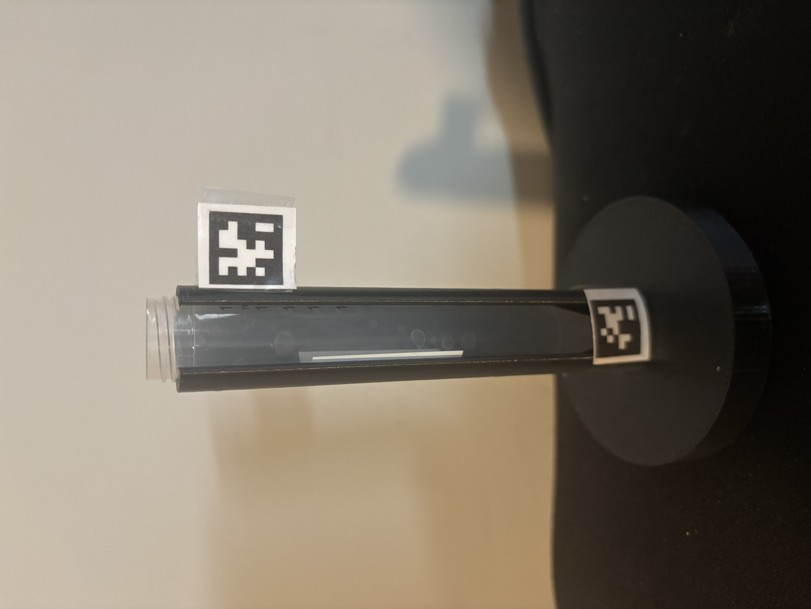
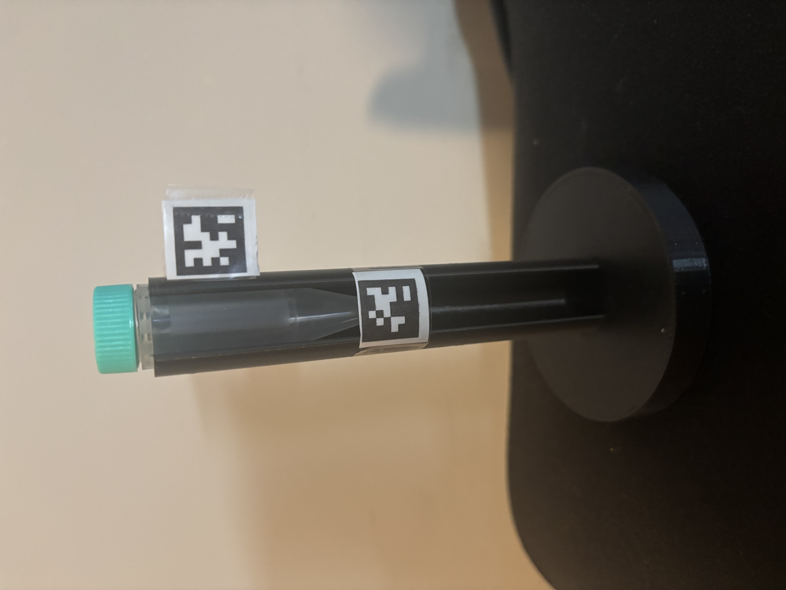

# AprilTag Test Tube Holder Setup Guide
 
A step-by-step guide for generating two AprilTags (tag 0 and tag 1 from the
`tag36h11` family), printing them at 20 mm, cutting them out, and mounting them
on a test tube holder — including how to adjust the layout for a smaller test
tube.
 
**Generator used:** <https://chaitanyantr.github.io/apriltag.html>
*(Free, browser-based AprilTag generator by Chaithanya Krishna Bodduluri. Runs
locally — no signup, no upload. The markers it produces are bit-for-bit
identical to the official AprilRobotics images, so they work with `apriltag`,
`apriltag_ros`, OpenCV, and any standard detector.)*
 
---
 
## What you'll need
 
- A computer with a web browser
- A printer (laser preferred for crisp black edges; inkjet is fine)
- Plain white paper or sticker/label sheets
- Scissors or a craft knife + cutting mat
- Glue stick, double-sided tape, or pre-cut label adhesive
- Your test tube holder
- A ruler (to verify printed size)

 
## Part 1 — Generate the tags and download the PDF
 
Add both tags to a single sheet, then download **only the PDF** — do **not** use
the Save SVG option.
 
1. Open <https://chaitanyantr.github.io/apriltag.html>.
2. Under **Tag family**, select **`tag36h11`**.
   *(587 IDs available, IDs 0–586, very robust — the standard recommendation.)*
3. In **Tag ID**, enter **`0`**.
4. In **Total size (mm)**, enter **`20`**.
   - Confirm **Tag size (mm)** auto-fills to **16** (this is your detector value).
5. Check the **Live preview** shows ID 0, then click **+ Add to sheet**.
6. Change **Tag ID** to **`1`** (leave size at 20 mm) and click **+ Add to
   sheet** again.
7. Click **🖨 Print / PDF**, and in the print dialog choose **"Save as PDF"** as
   the destination to download the file. This PDF is an A4 sheet containing both
   tags, each wrapped in a dashed cut line.
> Download and use **only this PDF** for printing. Don't save or print the SVG.
 
---
 
## Part 2 — Print and verify size
 
1. Open the downloaded **PDF** and print at **100% scale / "Actual size."**
   - ❗ Make sure **"Fit to page" / "Shrink to fit" is OFF** — that silently
     resizes the marker and ruins your measurement.
2. With a ruler, measure the printed marker:
   - **Outer black border edge to edge ≈ 20 mm** (total size), **or**
   - **Inner solid black square ≈ 16 mm** (tag size).
3. If the measurement is off, fix the print scaling and reprint before cutting.
---
 
## Part 3 — Cut them out (leave a white border)
 
AprilTags need a **white "quiet zone"** around the black border to be detected
reliably. Don't cut flush to the black.
 
1. Cut **outside** the black border, leaving roughly **2–4 mm of white** all the
   way around each tag.
2. Keep the corners square and the cuts straight — clean edges help corner
   detection.
3. Keep the white margin **even** on all four sides.
You should now have **two cut-out tags: tag 0 and tag 1**, each with a white
border.
 
---
 
## Part 4 — Mount on the test tube holder (standard tube)
 


> 📷 **Reference: `image_1.jpg`** — shows the standard mounting layout.
 
Using the standard test tube as your reference:
 
1. Decide tag orientation — keep both tags **upright and facing the camera**,
   with the **same rotation** so your detector sees a consistent layout.
2. Mount **tag 0** at the **upper** position on the holder (as shown in
   `image_1.jpg`).
3. Mount **tag 1** at the **lower** position on the holder (as shown in
   `image_1.jpg`).
4. Affix with glue stick, double-sided tape, or label adhesive. Press flat —
   **avoid bubbles, wrinkles, or curl**, since any warp distorts pose estimation.
5. Make sure neither tag is obscured by clips, racks, or the tube itself when
   seated.
*(Exact heights and spacing follow the positions shown in `image_1.jpg`.)*
 
---
 
## Part 5 — Adjust for a smaller test tube


 
> 📷 **Reference: `image_2.jpg`** — shows the adjusted layout for a smaller tube.
 
When the holder is used with a **smaller test tube**, the lower tag must follow
the new tube geometry:
 
1. Keep **tag 0** in its **upper position** — unchanged from Part 4.
2. **Move tag 1 (the lower tag) upward** so it sits at the **start of the bottom
   of the smaller test tube** (i.e., aligned with where the shorter tube now
   bottoms out), as shown in `image_2.jpg`.
3. Re-check that both tags are flat, square, upright, and unobstructed.
This keeps the lower tag referenced to the actual base of the tube in use rather
than the base of the original (taller) tube.
 
```
  STANDARD TUBE (image_1.jpg)        SMALLER TUBE (image_2.jpg)
  ┌───────────┐                      ┌───────────┐
  │ [tag 0]   │ upper                │ [tag 0]   │ upper (unchanged)
  │           │                      │ [tag 1]   │ ← moved up to the
  │           │                      │           │   bottom of the
  │ [tag 1]   │ lower                │           │   smaller tube
  └───────────┘                      └───────────┘
```
 
---
 
## Quick reference
 
| Item | Value |
|------|-------|
| Tag family | `tag36h11` |
| Tag IDs | `0` and `1` |
| Total (printed) size | 20 mm |
| Tag size (detector value) | 16 mm |
| White cut border | ~2–4 mm all around |
| Print scale | 100% / Actual size (no fit-to-page) |
| tag36h11 ratio | tag size = 0.80 × total size |
 
---
 
## Tips & troubleshooting
 
- **Tag won't detect:** confirm you fed the detector the **tag size (16 mm)**,
  not the total size; check the white quiet zone is present; ensure the tag is
  flat and well-lit.
- **Pose looks scaled wrong:** almost always a size-field mix-up (16 vs 20 mm)
  or a printer "fit to page" that changed the physical size — re-measure with a
  ruler.
- **Glare / washout:** use matte paper or a matte laminate; avoid glossy
  finishes under direct light.
- **Durability:** laminate or use matte sticker stock if the holder will be
  handled, washed, or used repeatedly.
- **Consistency:** keep both tags the same size, same family, and same
  orientation so the detector treats them as a coherent set.
---
 
*Note: `image_1.jpg` and `image_2.jpg` are referenced above as the visual layout
for the standard and smaller-tube configurations. Place those two images in the
same folder as this markdown file so they render in the guide.*